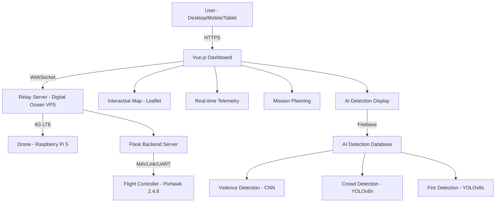

# AI-Powered Drone Surveillance System

<div align="center">


[](https://opensource.org/licenses/MIT)
[](https://vuejs.org/)
[](https://nodejs.org/)
[](https://socket.io/)
[](#)
[](http://makeapullrequest.com)


</div>

---


## 🎯 Overview

The **AI-Powered Drone Surveillance Dashboard** is the web-based control interface for our revolutionary open-source drone surveillance platform. This Vue.js application provides comprehensive real-time control, monitoring, and AI detection capabilities for professional-grade surveillance operations at a fraction of commercial costs.

### 🌟 Key Highlights

- **🎛️ Real-time Drone Control**: Complete flight control with mode switching and mission management
- **🗺️ Interactive Mission Planning**: Visual waypoint-based autonomous navigation planning
- **🤖 AI Detection Monitoring**: Live violence, crowd density, and fire incident detection
- **📊 Live Telemetry Dashboard**: Real-time GPS, battery, altitude, and flight status monitoring
- **🌐 Unlimited Range Control**: 4G LTE connectivity through relay server architecture
- **📱 Responsive Design**: Works seamlessly on desktop, tablet, and mobile devices
- **🔗 WebSocket Communication**: Real-time bidirectional data flow with sub-second latency

### 🎥 Project Demo Video

<div align="center">

https://github.com/user-attachments/assets/af29e985-e4e1-405c-846c-17f9033a3773


*Click to watch the complete dashboard demonstration*

</div>

## 🏗️ System Architecture

<div align="center">


*Dashboard architecture showing communication flow with drone system*

</div>

### Communication Architecture



## 🎬 Demo & Screenshots

### 🎥 Dashboard Demonstrations

<div align="center">

#### Complete Dashboard Overview
*Complete dashboard functionality demonstration*


#### AI Detection Monitoring


*Real-time AI detection monitoring and alerts*
</div>


### 🔄 Data Flow

1. **User Interface** → Vue.js dashboard connects to relay server via WebSocket
2. **Command Transmission** → Flight commands sent through relay to drone backend
3. **Telemetry Stream** → Real-time drone data flows back to dashboard
4. **AI Integration** → Firebase provides live AI detection results
5. **Mission Control** → Interactive map enables waypoint-based mission planning

## ✨ Key Features

### 🎛️ Flight Control Interface
- **Real-time Control**: Mode switching, arm/disarm, emergency stop
- **Mission Management**: Start, stop, and monitor autonomous missions
- **Safety Systems**: Pre-flight checks and error validation
- **Status Monitoring**: Live connection, GPS, and system health indicators

### 🗺️ Interactive Mission Planning
- **Visual Waypoint Setting**: Click-to-add waypoints on interactive map
- **Mission Parameters**: Configurable altitude, speed, and return-to-launch
- **Real-time Tracking**: Live drone position and mission progress
- **Mission Validation**: Pre-flight safety checks and parameter validation

### 🤖 AI Surveillance Monitoring
- **Live Detection Results**: Real-time violence, crowd, and fire detection alerts
- **Detection History**: Browsable timeline of AI detection events
- **Confidence Scoring**: Visual confidence indicators for detection accuracy
- **Alert Management**: Prioritized notifications based on detection severity

### 📊 Comprehensive Dashboard
- **Live Telemetry**: GPS coordinates, altitude, battery, and flight status
- **System Health**: Connection status, satellite count, and error monitoring
- **Performance Metrics**: Real-time flight data and system diagnostics
- **Responsive Design**: Optimized for desktop, tablet, and mobile devices

## 📝 Technical Specifications

### Frontend Performance
| Metric | Value | Conditions |
|--------|-------|------------|
| **Initial Load Time** | <2.5 seconds | Standard 4G connection |
| **Telemetry Update Rate** | 1-4 Hz | Real-time WebSocket updates |
| **Map Rendering** | <500ms | Leaflet tile loading |
| **Mission Planning Response** | <100ms | Waypoint addition/removal |
| **Mobile Responsiveness** | 100% | All screen sizes 320px+ |
| **Cross-browser Support** | 95%+ | Modern browsers (2020+) |

### Communication Performance
| Network Type | Latency | Reliability | Update Rate |
|--------------|---------|-------------|-------------|
| **WiFi (Good)** | 87ms | 99.8% | 4 Hz |
| **4G LTE (Good)** | 312ms | 98.7% | 2-4 Hz |
| **4G LTE (Poor)** | 578ms | 94.2% | 1-2 Hz |
| **3G Fallback** | 850ms | 89.3% | 0.5-1 Hz |

### Browser Compatibility
| Browser | Version | Support Level |
|---------|---------|---------------|
| **Chrome** | 88+ | Full Support ✅ |
| **Firefox** | 85+ | Full Support ✅ |
| **Safari** | 14+ | Full Support ✅ |
| **Edge** | 88+ | Full Support ✅ |
| **Mobile Safari** | iOS 14+ | Full Support ✅ |
| **Chrome Mobile** | Android 8+ | Full Support ✅ |

## 🛠️ Installation & Setup

### Prerequisites
```bash
# System requirements
- Node.js 16+ and npm
- Modern web browser with WebSocket support
- Internet connection for dependencies and tile loading
```

### 1. Repository Setup

#### 1.1 Clone Repository
```bash
# Clone the dashboard repository
git clone https://github.com/KetanBhoye/drone-dashboard-ui.git
cd drone-dashboard-ui
```

#### 1.2 Install Dependencies
```bash
# Install all required npm packages
npm install

# Verify installation
npm list
```

### 2. Configuration

#### 2.1 Server Configuration
Update relay server URL in `src/App.vue`:
```javascript
// Line 39: Update with your relay server IP
const RELAY_SERVER_URL = 'http://143.110.254.9:3000'
```

#### 2.2 Firebase Configuration
Configure Firebase in `src/components/FirebaseSurveillance.vue`:
```javascript
const firebaseConfig = {
  apiKey: "your-api-key-here",
  authDomain: "wce-surveillance.firebaseapp.com",
  databaseURL: "https://wce-surveillance-default-rtdb.firebaseio.com",
  projectId: "wce-surveillance",
  storageBucket: "wce-surveillance.appspot.com",
  messagingSenderId: "224246463722",
  appId: "1:224246463722:web:3e34b89fd00c14ea9582d4"
};
```

#### 2.3 Map Configuration
Customize map settings in `src/components/DroneMap.vue`:
```javascript
// Default map center (Mumbai coordinates)
const initialCenter = [19.0760, 72.8777];
const initialZoom = 16;
```

### 3. Development Environment

#### 3.1 Start Development Server
```bash
# Start with hot reload
npm run serve

# Access dashboard at:
# http://localhost:8080
```

#### 3.2 Build for Production
```bash
# Create optimized production build
npm run build

# Files will be generated in dist/ folder
```

### 4. Production Deployment

#### 4.1 Web Server Deployment
```bash
# Deploy to Apache/Nginx
sudo cp -r dist/* /var/www/html/

# Configure web server
sudo systemctl restart nginx
```

#### 4.2 Docker Deployment
```dockerfile
FROM node:16-alpine
WORKDIR /app
COPY package*.json ./
RUN npm install
COPY . .
RUN npm run build
EXPOSE 80
CMD ["npm", "run", "serve", "--", "--port", "80", "--host", "0.0.0.0"]
```

## 📖 Usage Guide

### Basic Operations

#### 1. Dashboard Access
1. **Open web browser** and navigate to dashboard URL
2. **Wait for connection** - system automatically connects to relay server
3. **Verify status** - green indicators show successful connections
4. **Check drone status** - ensure drone is powered and connected

#### 2. Flight Control
1. **Monitor telemetry** - verify GPS fix and battery level
2. **Select flight mode** - choose appropriate mode (GUIDED, AUTO, etc.)
3. **Arm vehicle** - enable motors when ready for flight
4. **Monitor status** - watch real-time telemetry and alerts

#### 3. Mission Planning
1. **Click "Set Waypoints"** - enter waypoint placement mode
2. **Click on map** - add waypoints by clicking desired locations
3. **Configure settings** - set altitude, speed, and return-to-launch
4. **Start mission** - upload and execute autonomous mission
5. **Monitor progress** - track mission execution in real-time

### AI Detection Monitoring

#### Detection Types & Responses
```javascript
// Violence Detection Alert
{
  "type": "violence",
  "confidence": 0.917,
  "message": "Violence detected!",
  "action": "Immediate alert dialog + system log"
}

// Crowd Detection Alert
{
  "type": "crowd", 
  "confidence": 0.847,
  "density": "high",
  "action": "Warning notification + log entry"
}

// Fire Detection Alert
{
  "type": "fire",
  "confidence": 0.792,
  "severity": "moderate", 
  "action": "Critical alert dialog + system log"
}
```

#### Alert Priority Levels
- **🔴 Critical**: Violence, Fire → Immediate modal dialog
- **🟡 Warning**: High crowd density → Notification + log
- **🟢 Info**: Normal crowd detection → Log entry only

## 🧩 Component Documentation

### 📁 Project Structure
```
drone-dashboard-ui/
├── 📁 public/
│   ├── index.html                   # Main HTML template
│   └── favicon.ico                  # Application icon
├── 📁 src/
│   ├── 📄 App.vue                   # Main application component
│   ├── 📄 main.js                   # Application entry point
│   ├── 📁 components/
│   │   ├── 📄 DroneMap.vue          # Interactive mapping & mission planning
│   │   ├── 📄 DroneDashboard.vue    # Flight controls & telemetry display
│   │   ├── 📄 LogContainer.vue      # System logs & debugging interface
│   │   ├── 📄 StatusPanel.vue       # GPS & vehicle status indicators
│   │   ├── 📄 ErrorDialog.vue       # User-friendly error handling
│   │   ├── 📄 FirebaseSurveillance.vue # AI detection monitoring
│   │   ├── 📄 DroneCamera.vue       # Live camera feed (JSMpeg)
│   │   ├── 📄 DroneWebRTC.vue       # WebRTC video streaming
│   │   └── 📄 HelloWorld.vue        # Default Vue component
│   └── 📁 assets/
│       └── main.css                 # Tailwind CSS imports
├── 📄 package.json                  # Dependencies and scripts
├── 📄 tailwind.config.js            # Tailwind CSS configuration  
├── 📄 vue.config.js                 # Vue CLI configuration
├── 📄 babel.config.js               # Babel transpilation config
├── 📄 jsconfig.json                 # JavaScript project config
├── 📄 postcss.config.js             # PostCSS configuration
└── 📄 README.md                     # This documentation
```

### 🎛️ Main App (App.vue)
**Purpose**: Main application container and state management
- **Connection Management**: WebSocket connection to relay server
- **Global State**: Manages telemetry data and connection status
- **Event Coordination**: Handles inter-component communication
- **Error Handling**: Centralized error dialog management

**Key Features**:
```javascript
// Real-time connection management
const connected = ref(false)
const connecting = ref(false)

// Telemetry data state
const telemetry = ref({
  lat: 0, lon: 0, alt: 0, battery_percentage: 0,
  mode: 'UNKNOWN', armed: false, satellites_visible: 0
})

// WebSocket event handling
socket.on('telemetry', (data) => {
  telemetry.value = data
  updateDashboard(data)
})
```

### 🗺️ Drone Map (DroneMap.vue)  
**Purpose**: Interactive mapping and mission planning interface
- **Leaflet Integration**: Full-featured interactive mapping
- **Waypoint Management**: Click-to-add waypoint functionality
- **Mission Visualization**: Real-time drone position and mission progress
- **Parameter Configuration**: Flight altitude, speed, and RTL settings

**Key Features**:
```javascript
// Mission planning functionality
const waypoints = ref([])
const missionSettings = ref({
  altitude: 10,
  speed: 5, 
  returnToHome: true
})

// Interactive map controls
const handleMapClick = (e) => {
  if (isSettingWaypoints.value) {
    waypoints.value.push({
      lat: e.latlng.lat,
      lng: e.latlng.lng,
      alt: missionSettings.value.altitude
    })
  }
}
```

### 📊 Dashboard (DroneDashboard.vue)
**Purpose**: Flight control and telemetry display
- **Flight Controls**: Mode selection, arm/disarm controls  
- **Telemetry Display**: Real-time flight data visualization
- **Battery Monitoring**: Visual battery level indicators
- **Status Information**: Current mode, GPS, and system health

**Key Features**:
```javascript
// Flight mode management
const flightModes = [
  'STABILIZE', 'ALTHOLD', 'LOITER', 
  'RTL', 'GUIDED', 'AUTO', 'LAND'
]

// Battery status visualization
const getBatteryClass = (percentage) => {
  if (percentage < 20) return 'battery-critical'
  if (percentage < 50) return 'battery-warning'  
  return 'battery-good'
}
```

### 📝 Log Container (LogContainer.vue)
**Purpose**: System logging and debugging interface
- **Real-time Logs**: Live system event display
- **Log Filtering**: Filter by type (info, warning, error)
- **Auto-scroll**: Automatic scrolling with manual override
- **Log Management**: Clear logs and export functionality

**Key Features**:
```javascript
// Log filtering and display
const filteredLogs = computed(() => {
  if (filterType.value === 'all') return props.logs
  return props.logs.filter(log => log.type === filterType.value)
})

// Timestamp formatting
const formatTimestamp = (timestamp) => {
  const date = new Date(timestamp)
  return date.toLocaleTimeString() + '.' + 
         date.getMilliseconds().toString().padStart(3, '0')
}
```

### 🛰️ Status Panel (StatusPanel.vue)
**Purpose**: GPS and vehicle status monitoring
- **GPS Status**: Fix type, satellite count, and signal quality
- **Battery Indicators**: Visual battery level with color coding
- **Vehicle Status**: Armed state and flight mode display
- **Connection Health**: Real-time connection status indicators

**Key Features**:
```javascript
// GPS status visualization
const gpsStatusText = computed(() => {
  const fixTypes = {
    0: 'No Fix', 1: '1D Fix', 2: '2D Fix', 
    3: '3D Fix', 4: '3D Fix+DGPS', 5: 'RTK Float', 6: 'RTK Fixed'
  }
  return fixTypes[gpsStatus.value.fix_type] || 'Unknown'
})

// Status indicator classes
const gpsDotClass = computed(() => {
  if (gpsStatus.value.fix_type < 2) return 'gps-dot-bad'
  return gpsStatus.value.fix_type === 2 ? 'gps-dot-medium' : 'gps-dot-good'
})
```

### 🤖 AI Surveillance (FirebaseSurveillance.vue)
**Purpose**: AI detection monitoring and alerts
- **Firebase Integration**: Real-time detection data streaming
- **Detection Display**: Live AI detection results with confidence scores
- **Alert Management**: Prioritized notifications based on detection type
- **History Browser**: Browsable timeline of detection events

**Key Features**:
```javascript
// Firebase real-time listener
imagesRef.limitToLast(10).on('value', (snapshot) => {
  const data = snapshot.val()
  if (data) {
    const imagesArray = Object.entries(data)
      .map(([key, value]) => ({ id: key, ...value }))
      .sort((a, b) => new Date(b.Time) - new Date(a.Time))
    
    if (imagesArray.length > 0) {
      const newImage = imagesArray[0]
      latestImage.value = newImage
      
      // Emit detection events for critical alerts
      if (newImage.Category.toLowerCase().includes('violence')) {
        emit('detection', {
          type: 'violence',
          message: `${newImage.Category} detected!`,
          confidence: newImage.Confidence
        })
      }
    }
  }
})
```

### ⚠️ Error Dialog (ErrorDialog.vue)
**Purpose**: User-friendly error handling and resolution guidance
- **Modal Interface**: Clean modal dialog for error display
- **Resolution Guidance**: Actionable steps for error resolution
- **Action Buttons**: Dynamic action buttons for error recovery
- **Transition Effects**: Smooth modal animations

## 🔌 API Integration

### WebSocket Communication

#### Connection Management
```javascript
// Connect to relay server
const socket = io('http://143.110.254.9:3000')

// Identify as control client
socket.emit('identify', 'control')

// Handle connection events
socket.on('connect', () => {
  console.log('Connected to relay server')
  connected.value = true
})

socket.on('drone_connection', (data) => {
  droneConnected.value = data.connected
})
```

#### Command Transmission
```javascript
// Send flight mode command
socket.emit('command', {
  type: 'set_mode',
  mode: 'GUIDED'
})

// Send mission data
socket.emit('mission', {
  type: 'start',
  waypoints: waypoints.value,
  settings: missionSettings.value
})

// Handle command responses
socket.on('command_response', (response) => {
  if (!response.success) {
    showErrorDialog(response.error, response.resolution)
  }
})
```

#### Real-time Data Streams
```javascript
// Receive telemetry updates
socket.on('telemetry', (data) => {
  telemetry.value = data
  updateDashboard(data)
  updateMap(data.lat, data.lon)
})

// Receive system logs
socket.on('logs', (logData) => {
  logs.value = logData
  displayLogs(logData)
})
```

### REST API Endpoints

The dashboard also supports direct HTTP API integration:

```bash
# Health check endpoint
GET /health
Response: {
  "status": "healthy",
  "connected": true,
  "gps": {"fix_type": 3, "satellites": 12},
  "battery": 85,
  "mode": "GUIDED"
}

# Telemetry data endpoint  
GET /telemetry
Response: {
  "lat": 19.0760, "lon": 72.8777, "alt": 50.5,
  "battery_percentage": 85, "mode": "AUTO",
  "armed": true, "groundspeed": 5.2
}

# Mission control endpoints
POST /mission/start
POST /mission/stop
GET /mission/status
```

## 📈 Performance Metrics

### Dashboard Performance

<div align="center">


</div>

#### Responsiveness Testing Results
| Metric | Desktop | Tablet | Mobile | Target |
|--------|---------|--------|--------|--------|
| **Initial Load** | 1.8s | 2.2s | 2.8s | <3.0s |
| **Map Rendering** | 340ms | 480ms | 620ms | <1.0s |
| **Telemetry Update** | 85ms | 95ms | 120ms | <200ms |
| **Mission Planning** | 45ms | 65ms | 85ms | <100ms |
| **WebSocket Latency** | 87ms | 312ms | 350ms | <500ms |

#### Browser Compatibility Testing
| Browser | Desktop Score | Mobile Score | Issues |
|---------|---------------|--------------|--------|
| **Chrome 120+** | 100% | 100% | None |
| **Firefox 119+** | 98% | 95% | Minor CSS |
| **Safari 17+** | 95% | 98% | WebSocket delay |
| **Edge 119+** | 100% | 98% | None |

#### Network Performance
```
WiFi Connection:     87ms latency, 99.8% reliability
4G LTE (Good):      312ms latency, 98.7% reliability  
4G LTE (Poor):      578ms latency, 94.2% reliability
3G Fallback:        850ms latency, 89.3% reliability

Data Usage:         2-5 Kbps sustained, 15-25 Kbps peak
Battery Impact:     Minimal (web-based application)
```


## 🔧 Troubleshooting

### Common Issues & Solutions

#### Connection Problems

**Issue**: "Failed to connect to relay server"
```bash
# Check server status
curl http://143.110.254.9:3000/health

# Verify network connectivity
ping 143.110.254.9

# Check browser console for errors
# Open Developer Tools → Console tab
```

**Issue**: "WebSocket connection failed"
```bash
# Verify WebSocket support
# Modern browsers support WebSockets by default
# Check for corporate firewall blocking WebSocket ports

# Test WebSocket connectivity
wscat -c ws://143.110.254.9:3000
```

#### Dashboard Loading Issues

**Issue**: "Dashboard not loading or blank screen"
```bash
# Clear browser cache and cookies
# Ctrl+Shift+R (hard refresh)

# Check JavaScript console errors
# F12 → Console tab → Look for red errors

# Verify all dependencies loaded
# Network tab → Check for failed requests
```

**Issue**: "Map tiles not loading"
```bash
# Check internet connectivity
ping tile.openstreetmap.org

# Verify Leaflet.js loaded correctly
# Console → Check for Leaflet errors

# Try refreshing map component
# Click center drone button to reset map
```

#### Real-time Data Issues

**Issue**: "Telemetry not updating"
```bash
# Check WebSocket connection status
# Look for green "Connected" indicator

# Verify drone backend is running
curl http://drone-ip:5000/health

# Check for JavaScript errors
# F12 → Console → Look for Socket.IO errors
```

**Issue**: "AI detection not showing"
```bash
# Verify Firebase configuration
# Check firebaseConfig in FirebaseSurveillance.vue

# Test Firebase connection
# Browser → Network tab → Check for Firebase requests

# Verify database permissions
# Firebase Console → Database → Rules
```

### Development Debugging

#### Vue.js Debugging
```bash
# Install Vue DevTools browser extension
# Chrome: Vue.js devtools extension
# Firefox: Vue.js devtools add-on

# Enable development mode
npm run serve

# Check component data and props
# Vue DevTools → Components tab
```

#### Network Debugging
```bash
# Monitor WebSocket traffic
# F12 → Network → WS filter → Watch messages

# Check API calls
# Network → XHR filter → Monitor REST calls

# Analyze performance
# Performance tab → Record page load
```

### Performance Optimization

#### Slow Loading Issues
```bash
# Optimize build size
npm run build --analyze

# Enable gzip compression
# Configure web server for compression

# Use CDN for static assets
# Move large assets to CDN
```

#### Memory Usage Issues
```bash
# Monitor memory usage
# F12 → Memory tab → Take heap snapshot

# Check for memory leaks
# Components tab → Watch component lifecycle

# Optimize image sizes
# Compress screenshots and thumbnails
```

## 🤝 Contributing

We welcome contributions to improve the dashboard! Here's how you can help:

### 🐛 Bug Reports
- Use the [Bug Report Template](.github/ISSUE_TEMPLATE/bug_report.md)
- Include browser version and console errors
- Provide steps to reproduce the issue
- Attach screenshots if applicable

### ✨ Feature Requests
- Use the [Feature Request Template](.github/ISSUE_TEMPLATE/feature_request.md)
- Describe the use case and expected behavior
- Consider implementation complexity and impact
- Include mockups or wireframes if possible

### 🔧 Code Contributions

#### Frontend Development
```bash
# Setup development environment
npm install
npm run serve

# Follow Vue.js style guide
# https://vuejs.org/style-guide/

# Run linting
npm run lint

# Build and test
npm run build
```

#### Component Development Guidelines
```javascript
// Use Composition API
import { ref, computed, onMounted } from 'vue'

// Follow naming conventions
// Components: PascalCase (DroneMap.vue)
// Props: camelCase (telemetryData)
// Events: kebab-case (update-status)

// Add proper prop validation
props: {
  connected: {
    type: Boolean,
    required: true
  },
  telemetry: {
    type: Object,
    required: true,
    validator: (value) => {
      return value && typeof value.lat === 'number'
    }
  }
}
```

#### Styling Guidelines
```css
/* Use Tailwind CSS utility classes */
<div class="bg-white rounded-lg shadow-md p-4">

/* Add custom CSS only when necessary */
<style scoped>
.custom-component {
  /* Component-specific styles */
}
</style>

/* Follow responsive design patterns */
<div class="grid grid-cols-1 md:grid-cols-2 lg:grid-cols-3">
```

### 📖 Documentation
- Improve installation guides
- Add component documentation
- Create video tutorials
- Translate to other languages

### Development Workflow
1. **Fork** the repository
2. **Create** a feature branch (`git checkout -b feature/amazing-feature`)
3. **Develop** and test your changes
4. **Document** new features
5. **Commit** with clear messages (`git commit -m 'Add amazing feature'`)
6. **Push** to your branch (`git push origin feature/amazing-feature`)
7. **Open** a Pull Request

## 📜 License

This project is licensed under the **MIT License** - see the [LICENSE](LICENSE) file for details.

### Commercial Use Allowed ✅
- Use in commercial applications
- Modify and distribute
- Private use without restrictions
- **Attribution Required**: Include original license

## 🙏 Acknowledgments

### 🎓 Academic Institution
- **Walchand College of Engineering, Sangli** - Department of Computer Science and Engineering
- **Dr. Nitin L. Gavankar** - Project Guide and Supervisor  
- **Mrs. Dr. M. A. Shah** - Head of Department

### 👥 Development Team
- **Ketan Yashwant Bhoye** (22520002) - System Architecture & Backend Integration
- **Vijay Sambhaji Mali** (22520008) - Frontend Development & UI/UX Design
- **Hemangi Ravindra More** (22520009) - AI Models Integration & Firebase Setup
- **Satyajit Sunilrao Gaikwad** (22520014) - Hardware Integration & Testing

### 🔧 Open Source Technologies
- **Vue.js Team** - Progressive JavaScript framework
- **Leaflet** - Open-source mapping library  
- **Socket.IO** - Real-time communication library
- **Tailwind CSS** - Utility-first CSS framework
- **Firebase** - Real-time database platform
- **OpenStreetMap** - Collaborative mapping project

### ☁️ Infrastructure Partners
- **Digital Ocean** - Cloud infrastructure for relay server
- **Firebase** - Real-time database for AI surveillance data
- **OpenStreetMap** - Map tiles and geospatial data

---

<div align="center">

### 🌟 Star History

[](https://star-history.com/#KetanBhoye/drone-dashboard-ui&Date)

### 📊 Project Statistics


### 🔗 Connect with Us

[](https://linkedin.com/in/ketan-bhoye-1b9981171)
[](mailto:imketanbhoye100@gmail.com)

---

**⭐ If this project helped you, please give it a star!**

</div>
